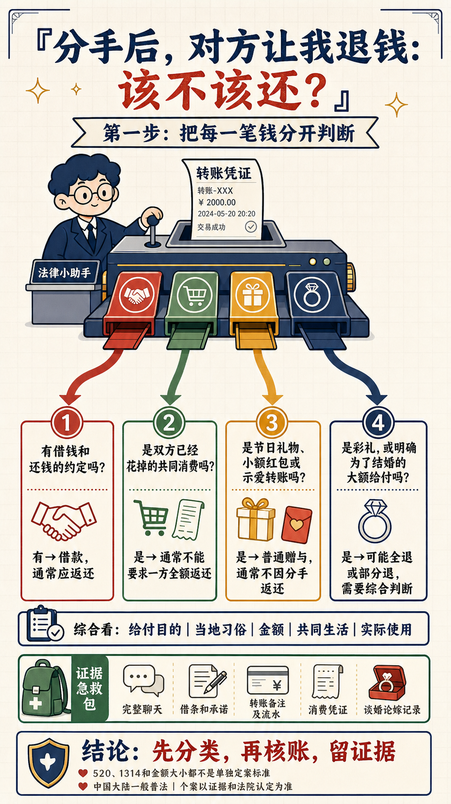
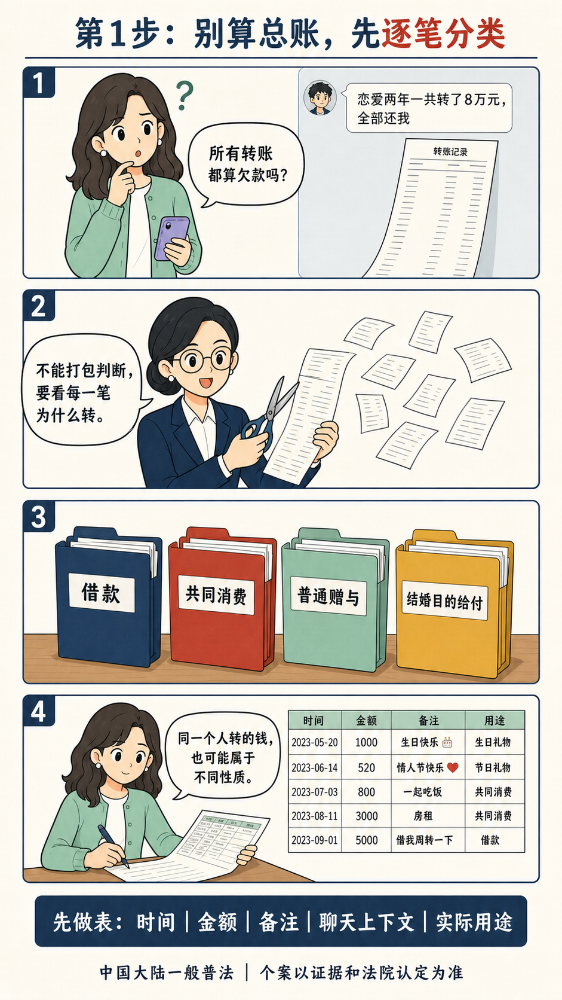

# Cognitive Path Comic Content

> 用视觉分镜控制用户认知路径，把复杂知识变成愿意看、看得懂、愿意收藏并能采取行动的漫画图文。



## 它解决什么问题

普通的“AI画漫画”往往先追求画风，再把文字硬塞进图片；结果是画面漂亮，但逻辑散、中文错、每页信息拥挤。

本 Skill 固化的是认知路径：

```text
停留 → 代入 → 看见事实 → 学会判断 → 完成反转 → 采取行动
```

行业知识、平台和视觉风格都可以变化，但用户理解问题的台阶必须清楚。

## 核心能力

- 动态规划 **5—8页**，不机械固定六页。
- 每页只完成 **1个认知动作**，每页 **1—2格**。
- 当前成熟模块：法律；可扩展主题：AI工具、教育、职场、商业、健康等。
- 先建立事实与专业判断，再设计分镜和画面。
- 固定角色、服装、配色和系列标识，减少连续漫画漂移。
- 逐页生成、逐页验收，不让整批任务互相拖住。
- 内置事实、适用范围、认知密度、人物连续性、中文排版和安全合规七道质量门禁。

## 直接这样说就能触发

无需记住英文 Skill 名称，使用自然语言即可：

```text
以“租房押金不退”为主题画一组漫画。
围绕“为什么用了AI还是写不好周报”做一期漫画图文。
把这个法律案例做成科普漫画。
把这篇文章改成连续漫画。
做一张首图，再做5—8张正文图。
用一页纸漫画讲清楚这个概念。
帮我设计漫画分镜，先不要出图。
按小红书形式做成可收藏漫画。
给这个主题做每页1—2格的系列漫画。
沿用上一期角色和画风，继续做下一期。
```

## 四种工作模式

| 模式 | 输出 |
|---|---|
| `plan` | 选题建模、认知路径、5—8页分镜 |
| `prompts` | 分镜＋逐页出图提示词，不生成图片 |
| `generate` | 策划、提示词、逐页出图、质量检查 |
| `publish` | 在成图基础上补充标题、正文、评论区引导和复盘字段 |

## 系统架构

```text
Source Material
  ↓
EpisodeBrief          事实、用户、冲突、依据、边界
  ↓
CognitivePath         看前怎么想 → 看后怎么判断
  ↓
PagePlan[]            每页一个认知动作、1—2格
  ↓
RenderSpec[]          角色、场景、文字层级、构图
  ↓
GeneratedPages[]      逐页生成与失败恢复
  ↓
QAReport              七道质量门禁
  ↓
PublishingPack        标题、正文、评论区、复盘
```

Core只控制认知路径和生产流程；行业模块负责专业判断与合规。当前内置法律模块，其他行业使用统一模块模板扩展。

## 完整产物长什么样

一次完整任务不是直接产出几张图，而是形成一条可检查的交付链：

```text
用户一句话需求
  → EpisodeBrief：用户、事实、风险、依据、边界
  → CognitivePath：看前怎么想、看后怎么判断
  → PagePlan：5—8页，每页一个认知动作
  → RenderSpec：逐页画面、文字、角色和禁止项
  → Pages：逐页生成或后期叠字
  → QAReport：七道门禁逐页验收
  → PublishingPack：标题、正文、评论区问题和复盘字段
```

法律示例已展开在 [`references/examples/legal-breakup-money.md`](references/examples/legal-breakup-money.md)。它展示了同一个选题如何从认知目标走到分镜、提示词、QA 和发布物料。

## 出图落地方式

本 Skill 不绑定某个图像模型。推荐流程是：

1. 先生成 `EpisodeBrief`、`CognitivePath` 和 `PagePlan`。
2. 再把每页 `RenderSpec` 保存成独立提示词文件。
3. 逐页生成，逐页检查文字、人物连续性和事实条件。
4. 关键中文不稳定时，使用“无字插画 + 后期叠字”，不要接受错字成图。
5. 某页失败时只重做失败页和受影响页面，不整组推翻。

## 示例：恋爱转账纠纷

同一个主题被拆成“首图负责停留，正文负责教学”：

| 首图 | 逐笔分类 | 借款证据 |
|---|---|---|
|  |  |  |

示例只展示结构与风格，不构成针对个案的法律意见。

## 安装

### Codex个人Skill

```bash
git clone https://github.com/xiaogege6697/cognitive-path-comic-content.git
cp -R cognitive-path-comic-content ~/.codex/skills/cognitive-path-comic-content
```

重新开启会话后，直接使用上面的自然语言触发。

也可以从 GitHub Releases 下载 `.skill` 安装包。

## 目录

```text
cognitive-path-comic-content/
├── SKILL.md
├── references/
│   ├── core-contract.md
│   ├── visual-storyboard.md
│   ├── modules/
│   │   ├── legal.md
│   │   └── module-template.md
│   ├── templates/
│   │   ├── render-spec.md
│   │   └── qa-checklist.md
│   └── examples/
├── evals/
└── assets/showcase/
```

## 设计原则

1. 固定认知路径，不固定页数。
2. 默认一格，只有明确对照、因果或先后关系才使用两格。
3. 复杂度通过增加页面承载，不通过缩小字号承载。
4. 先证明，再表达；先结构，再出图。
5. 漫画不是装饰，而是用户完成判断的界面。

## 当前边界

- 法律模块要求核对法域、时间和一手依据，不包赢、不伪造法条、不替代正式法律意见。
- 其他高风险行业需要补充对应专业模块，不能只套用画面模板或通用表达。
- 图像模型的中文仍可能出错，关键文字必须逐字检查；必要时改用无字插画＋后期叠字。
- 当前仓库成熟模块是法律；其他行业适合先用 `plan` 或 `prompts` 模式，待依据和模块补齐后再进入 `generate`。

## License

[MIT](LICENSE)
